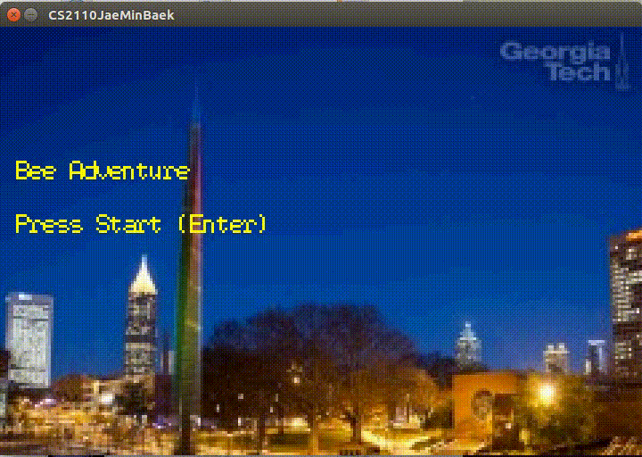

# BEE ADVENTURE 

Your bee wants to go to honeycomb to eat honey. 
However, there are obstacles(pipes) interuptting you from honeycomb section. 
If you win, you can see the georgia tech trade mark. 

All written in C. Used GBA Emulator.


If your HP is 0, your bee will be dead. Move your bee to survive! 

# Control
Use your left right arrow key. (Use 'a' and 'd' key for alternative)
Press 'TAB' to reset

# Setup & Run
1. download the entire folder
2. Follow the GBA Installation Guide (GBA_InstallationGBA instllation guide.txt)
3. moves to the project folder
```
$ cd src
```
4. compile the project file
```
$ make 
```
It will generate 
5. open CS2110JaeMinBaek.dba 

6. If you've never executed GBA emulator, you will be required to download some software. Just Click 'Yes'

7. You will see the game screen. Enjoy! 

## Extra
1. You can change the blocks if the game is too hard or maybe too boring. 
  1) open 'myLib.c' on your textpad
  2) In 'waitForVblank()' method, change the game speed. 
  3) Save the file
  4) Don't forget to compile 
  ```
  make
  ```
  5) open CS2110JaeMinBaek.dba 

2. You can clean the generated files 
```
$ make clean
```

3. You can reset any time you want with SELECT key (GBA Select key should be delete key in keyboard) You might think my pipes have tearings between top and bottom. But the image has a black gap originally. So it's not tearing!! Just to make sure I'm uploading one of pipes in to the zip file.


